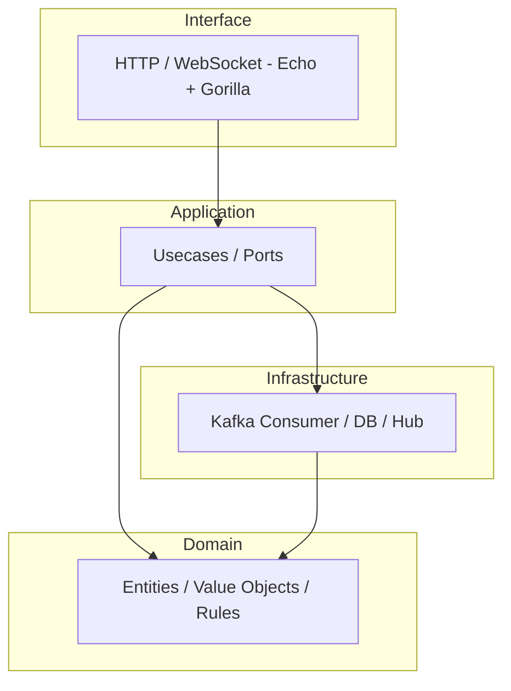

# MesaYa — Guía de Clean Architecture en Go

## Objetivo

Esta guía adapta los principios de Clean Architecture (Robert C. Martin), DDD
y organización por feature al ecosistema Go y al layout de este proyecto
(realtime-go). Su propósito es ofrecer una referencia práctica para estructurar
módulos, responsabilidad de capas, convención de nombres y buenas prácticas
para mantener el dominio aislado, facilitar pruebas y permitir cambiar
implementaciones externas sin tocar la lógica de negocio.

La estructura actual del repo y la arquitectura se expresan mejor con un
diagrama y un fallback ASCII claro. Incluyo ambas opciones: una versión
Mermaid (si tu visor de Markdown la soporta) y un árbol ASCII legible en
monoespacio.

Mermaid (recommended for GitHub/GitLab that soporten Mermaid):



Fallback ASCII (monospace):

```text
realtime-go/
├─ cmd/
│  └─ server/
│     └─ main.go               # wiring, config, DI
├─ internal/
│  ├─ app/                     # application-wide helpers (hub, clients)
│  │  ├─ hub.go
│  │  ├─ client.go
│  │  └─ handler.go
│  ├─ broker/                  # kafka consumer + registry wiring
│  │  ├─ consumer.go
│  │  └─ registry.go
│  ├─ config/
│  │  └─ config.go
│  ├─ realtime/                 # feature: realtime
│  │  ├─ domain/
│  │  │  └─ message.go
│  │  ├─ application/
│  │  │  ├─ pubsub_port.go
│  │  │  └─ broadcast_usecase.go
│  │  ├─ infrastructure/
│  │  │  ├─ websocket_hub.go
│  │  │  └─ registry.go
│  │  └─ transport/
│  │     └─ http_handler.go
│  └─ shared/
│     ├─ errors.go
│     ├─ logger.go
│     └─ utils.go
├─ Dockerfile
└─ go.mod
```

Nota: usar Mermaid ofrece una representación visual más clara en plataformas
que lo soporten; el ASCII es el fallback garantizado en cualquier visor.

## Macrovisión de capas adaptada a Go

- domain: entidades, value objects, interfaces de dominio (ports) y reglas
  puras de negocio.
- application (o usecase): casos de uso que orquestan el dominio. Define los
  _ports_ que usará la infraestructura y los DTOs ligeros.
- infrastructure: implementaciones concretas de repositorios, clientes HTTP,
  conexiones a bases de datos, brokers, etc.
- interface (transport): handlers HTTP, gRPC, WebSockets, CLI. Aquí se adaptan
  las requests/responses a los casos de uso.

Regla: Los paquetes importan solo hacia capas más internas. Por ejemplo,
`internal/infrastructure` puede importar `internal/application` y
`internal/domain`, pero `internal/domain` no debe importar infra o interface.

## Por qué esta separación en Go

- Go favorece paquetes pequeños con responsabilidades claras.
- Interfaces como contratos son simples y se colocan cerca del código que los
  consume (por ejemplo, en `application/ports` o `domain/ports`).
- La carpeta `internal/` protege la implementación de ser usada desde fuera.

## Estructura recomendada por feature (ejemplo `users`)

internal/
└── users/
├── domain/
│ ├── entity.go # User entity, rules invariants
│ ├── valueobject.go # Email, Password, etc.
│ └── port.go # domain-level interfaces (si aplica)
├── application/
│ ├── usecase.go # use cases (CreateUser, AuthenticateUser)
│ └── dto.go # input/output DTO structs
├── infrastructure/
│ ├── repo.go # UserRepository implementation (e.g. SQL)
│ └── migration.sql
└── transport/
├── http.go # HTTP handlers/adapters
└── websocket.go

Recomendación: Evita nombres largos en paquetes; prefiere `transport` o
`api` a `interface` por evitar palabra reservada y aclarar propósito.

## Contrato (mini-spec) para un caso de uso

- Entrada: DTO con datos primitivos (string, int, time). No pasar entidades
  ricas ni punteros a implementaciones externas.
- Salida: DTO serializable o un error concreto.
- Errores: Usa tipos de error bien definidos (var ErrNotFound = errors.New("..."))
  o implementa errores con códigos (type AppError struct { Code int; Msg string }).

Ejemplo:

- CreateUserUseCase(input CreateUserDTO) (UserDTO, error)

Edge cases:

- Input inválido
- Usuario ya existe
- DB inaccesible

## Convenciones por capa y ejemplos en Go

Domain

- Contendrá sólo lógica del negocio y contratos (interfaces) que no dependen
  de la infraestructura.
- No debe importar paquetes fuera de `internal/*` y stdlib.
- Ejemplo `internal/domain/user.go`:

  - Define struct `User` con métodos que mantienen invariantes.
  - Exporta `NewUser(...) (*User, error)` para crear una instancia válida.

Application / Usecases

- Implementa funciones o tipos que ejecutan un caso de uso.
- Reciben interfaces (ports) para persistencia o comunicación con infra.
- No importan drivers externos.

Ejemplo:

type UserRepository interface {
Save(ctx context.Context, u *domain.User) error
FindByEmail(ctx context.Context, email string) (*domain.User, error)
}

type CreateUser struct { repo UserRepository }

func (uc \*CreateUser) Execute(ctx context.Context, dto CreateUserDTO) (UserDTO, error) { ... }

Infrastructure

- Implementa `UserRepository` con SQL, Redis, Kafka, etc.
- Usa paquetes estándar y drivers (database/sql, github.com/lib/pq, etc.).
- Traduce resultados a entidades de dominio.

Transport / Interface

- Adapta requests (http) a DTOs del usecase y devuelve respuestas.
- Maneja validaciones de entrada básicas y convierte errores a códigos HTTP.

## Manejo de dependencias y wiring

- En Go el wiring se suele hacer en `cmd/server/main.go` o con un paquete `cmd`.
- Construye las dependencias desde afuera y pasa interfaces a los casos de uso.

Ejemplo minimal en `cmd/server/main.go`:

- Cargar config
- Conectar DB
- Crear repositorios concretos
- Crear usecases inyectando repos
- Iniciar servidor HTTP con handlers que usan los usecases

## Testing

- Domain: tests unitarios puros deben depender solo del paquete `domain`.
- Application: tests de usecases con mocks (por ejemplo usando interfaces y
  stubs manuales o con `github.com/golang/mock`).
- Infrastructure: tests de integración que usan DB en memoria o contenedores.
- Transport: tests E2E/integration contra el servidor.

Estructura de tests:

internal/users/domain/user_test.go
internal/users/application/usecase_test.go
internal/users/infrastructure/repo_integration_test.go

## Diseño de errores

- Define errores guardables y comparables:

var (
ErrUserNotFound = errors.New("user not found")
)

- Alternativamente, define AppError con códigos y mensajes si necesitas
  internacionalización o códigos de negocio.

## Serialización y DTOs

- DTOs deben ser tipos simples que representen la entrada/salida del caso de
  uso. No exponer entidades con métodos.
- Para JSON, anota campos con `json:"field_name"` y usa estructuras de salida
  específicas (UserResponse) para evitar exponer datos sensibles.

## Persistencia y repositorios

- Repositorios traducen entre modelos de persistencia (p. ej. sql rows o ORM
  models) y entidades del dominio.
- Mantén las SQL queries en paquetes de infra o archivos `.sql` para facilitar
  mantenimiento y revisión.

## Ejemplo práctico abreviado

1. Domain: `internal/domain/user.go`

```go
package domain

type User struct {
    ID   string
    Name string
    Email string
}

func NewUser(name, email string) (*User, error) {
    // validaciones
    return &User{ID: generateID(), Name: name, Email: email}, nil
}
```

2. Application: `internal/app/users/usecase.go`

```go
package users

type UserRepository interface {
    Save(ctx context.Context, u *domain.User) error
    FindByEmail(ctx context.Context, email string) (*domain.User, error)
}

type CreateUserDTO struct { Name, Email string }

func CreateUser(repo UserRepository, dto CreateUserDTO) (*domain.User, error) {
    // orquestación, reglas, llamadas al repo
}
```

3. Infrastructure: implementación SQL que satisface `UserRepository`.

4. Transport: handler HTTP que parsea JSON, llama a `CreateUser` y responde.

## Comunicación asíncrona (brokers)

- Define ports para publicar/consumir mensajes en `application/ports`.
- Implementa adaptadores en `infrastructure/broker`.
- Evita acoplar el dominio al formato del mensaje; define mappers que traduzcan
  entidades a payloads planos (map[string]interface{} o structs DTO serializables).

Ejemplo de folder que ya tienes: `internal/broker/consumer.go` y
`internal/broker/handlers.go`.

## Recomendaciones prácticas y estilo

- Prefiere composición sobre herencia (Go no tiene herencia clásica).
- Mantén paquetes pequeños: si uno crece demasiado, divídelo por subpaquetes.
- Exporta lo estrictamente necesario (nombres que empiezan con mayúscula).
- Documenta paquetes con comentarios `// Package users ...` y publica ejemplos
  simples en la documentación.
- Evita globales; pasar dependencias explícitamente facilita tests.
- Usa context.Context en todas las operaciones que puedan cancelarse o que
  requieran trazabilidad.

## Migración sugerida desde la estructura actual

1. Identificar boundaries: agrupa código por feature (users, orders, ...).
2. Extraer entidades y reglas a `internal/<feature>/domain`.
3. Crear `application` con los casos de uso y ports.
4. Implementar adaptadores concretos en `infrastructure`.
5. Wire en `cmd/server/main.go`.
6. Agregar tests unitarios y de integración por cada feature.

## Backlog y mejoras

- Añadir `shared` para utilidades: ID generator, time provider, error types.
- Introducir `migrations/` y scripts de seed.
- Documentar contrato de eventos y tópicos si se usa Kafka.
- Añadir ejemplos de wiring con fx/dig si el proyecto crece y necesitas
  inyección de dependencias más estructurada.

## Recursos y lecturas

- "Clean Architecture" — Robert C. Martin
- "Domain-Driven Design" — Eric Evans
- Go community: effective Go, standard library docs

---

Mantén este archivo vivo: actualízalo cuando cambies convenciones o cuando la
arquitectura evolucione. Si quieres, puedo generar un ejemplo mínimo runnable
que siga estas recomendaciones (un CRUD de usuarios con repositorio en memoria y
HTTP transport) para usar como plantilla en el repo.

## Recomendación práctica: handlers registrados por topic

Cuando uses brokers (Kafka, NATS, etc.) o una abstracción de pub/sub, es
altamente conveniente usar un registro declarativo de handlers por tópico.
Esto permite que los consumidores se inscriban de forma dinámica durante el
arranque y que los handlers sean módulos pequeños y testeables. La idea es:

- Definir una interfaz `TopicHandler` con método `Handle(ctx context.Context, msg Message) error`.
- Crear un `Registry` que reciba `TopicHandler` y el tópico asociado.
- El consumidor de mensajes itera sobre el registro y registra callbacks en el
  cliente del broker (o delega el enrutamiento a un `switch` central simple).

Ventajas:

- Evita `big switch` centralizado; cada feature expone su handler.
- Facilita pruebas unitarias de handlers individuales.
- Permite habilitar/deshabilitar handlers por config o en runtime.

Ejemplo conceptual de registro:

```go
// application/ports/pubsub.go
type TopicHandler interface {
  Topic() string
  Handle(ctx context.Context, msg *Message) error
}

// infrastructure/pubsub/registry.go
type Registry struct {
  handlers []TopicHandler
}

func (r *Registry) Register(h TopicHandler) { r.handlers = append(r.handlers, h) }

func (r *Registry) Handlers() []TopicHandler { return r.handlers }
```

En el arranque el consumidor de Kafka/NATS recorre `registry.Handlers()` y
subscribe a `h.Topic()` con `h.Handle`.

---

## Ejemplo completo: WebSockets en tiempo real con Echo + Gorilla WebSocket

Este ejemplo demuestra cómo organizar un feature `realtime` que mantiene
conexiones WebSocket, enruta mensajes por topic y se integra con la capa de
aplicación (usecases). Está pensado para usar junto al REST existente (que ya
publica eventos a Kafka): los usecases publican eventos a Kafka y el realtime
service puede consumirlos o servir actualizaciones en vivo.

Estructura propuesta (solo archivos clave mostrados):

internal/realtime/
├── domain/
│ └── message.go # tipos de mensaje y value objects
├── application/
│ ├── pubsub_port.go # TopicHandler interface
│ └── broadcast_usecase.go # usecase para broadcasting
├── infrastructure/
│ ├── websocket_hub.go # Hub, client, topic routing
│ └── registry.go # registro de TopicHandlers
└── transport/
└── http_handler.go # Echo handlers (upgrade WS)

En las siguientes secciones se muestra código ejemplo para cada pieza.

### 1) Domain: `message.go`

```go
package domain

import "time"

type Message struct {
  Topic     string                 `json:"topic"`
  Event     string                 `json:"event"`
  Payload   map[string]interface{} `json:"payload"`
  Timestamp time.Time              `json:"timestamp"`
}

func NewMessage(topic, event string, payload map[string]interface{}) *Message {
  return &Message{Topic: topic, Event: event, Payload: payload, Timestamp: time.Now().UTC()}
}
```

### 2) Application port: `pubsub_port.go`

```go
package application

import (
  "context"
  "github.com/your/module/internal/realtime/domain"
)

// TopicHandler es el contrato que implementan los handlers de tópicos.
type TopicHandler interface {
  Topic() string
  Handle(ctx context.Context, msg *domain.Message) error
}

// Broadcaster es un puerto simple que los usecases pueden usar para emitir
// mensajes hacia el hub de websockets (o hacia un broker).
type Broadcaster interface {
  Broadcast(ctx context.Context, msg *domain.Message) error
}
```

### 3) Infrastructure: Hub y registry

`websocket_hub.go` (simplificado):

```go
package infrastructure

import (
  "context"
  "sync"
  "time"

  "github.com/gorilla/websocket"
  "github.com/your/module/internal/realtime/domain"
)

type Client struct {
  conn *websocket.Conn
  send chan *domain.Message
  mu   sync.Mutex
}

func (c *Client) writePump() {
  ticker := time.NewTicker(54 * time.Second)
  defer func() { ticker.Stop(); c.conn.Close() }()
  for {
    select {
    case msg, ok := <-c.send:
      c.conn.SetWriteDeadline(time.Now().Add(10 * time.Second))
      if !ok {
        c.conn.WriteMessage(websocket.CloseMessage, []byte{})
        return
      }
      c.conn.WriteJSON(msg)
    case <-ticker.C:
      c.conn.SetWriteDeadline(time.Now().Add(10 * time.Second))
      if err := c.conn.WriteMessage(websocket.PingMessage, nil); err != nil {
        return
      }
    }
  }
}

type Hub struct {
  // mapping topic -> set of clients
  topics map[string]map[*Client]struct{}
  mu     sync.RWMutex
}

func NewHub() *Hub {
  return &Hub{topics: make(map[string]map[*Client]struct{})}
}

func (h *Hub) Register(topic string, c *Client) {
  h.mu.Lock()
  defer h.mu.Unlock()
  if _, ok := h.topics[topic]; !ok {
    h.topics[topic] = make(map[*Client]struct{})
  }
  h.topics[topic][c] = struct{}{}
}

func (h *Hub) Unregister(topic string, c *Client) {
  h.mu.Lock()
  defer h.mu.Unlock()
  if clients, ok := h.topics[topic]; ok {
    delete(clients, c)
    if len(clients) == 0 {
      delete(h.topics, topic)
    }
  }
}

func (h *Hub) Broadcast(ctx context.Context, msg *domain.Message) {
  h.mu.RLock()
  clients := h.topics[msg.Topic]
  h.mu.RUnlock()

  for c := range clients {
    select {
    case c.send <- msg:
    default:
      // cliente lento; drop y cleanup
      go func(cl *Client) { cl.conn.Close() }(c)
    }
  }
}

// Broadcaster adapter para usecases
type HubBroadcaster struct{ H *Hub }

func (b *HubBroadcaster) Broadcast(ctx context.Context, msg *domain.Message) error {
  b.H.Broadcast(ctx, msg)
  return nil
}
```

`registry.go` (registro de handlers por topic):

```go
package infrastructure

import "github.com/your/module/internal/realtime/application"

type Registry struct {
  handlers []application.TopicHandler
}

func NewRegistry() *Registry { return &Registry{} }

func (r *Registry) Register(h application.TopicHandler) { r.handlers = append(r.handlers, h) }

func (r *Registry) Handlers() []application.TopicHandler { return r.handlers }
```

### 4) Transport: Echo HTTP handler que realiza upgrade a WebSocket

`http_handler.go`:

```go
package transport

import (
  "net/http"

  "github.com/labstack/echo/v4"
  "github.com/gorilla/websocket"
  "github.com/your/module/internal/realtime/infrastructure"
)

var upgrader = websocket.Upgrader{ CheckOrigin: func(r *http.Request) bool { return true } }

func NewWebsocketHandler(hub *infrastructure.Hub) func(echo.Context) error {
  return func(c echo.Context) error {
    topic := c.QueryParam("topic")
    if topic == "" {
      return c.JSON(400, map[string]string{"error": "missing topic"})
    }
    rw := c.Response().Writer
    req := c.Request()
    conn, err := upgrader.Upgrade(rw, req, nil)
    if err != nil {
      return err
    }

    client := &infrastructure.Client{conn: conn, send: make(chan *domain.Message, 16)}
    hub.Register(topic, client)

    // Start writer
    go client.writePump()

    // Read pump (simple echo of ping/pong or subscription control)
    for {
      var m map[string]interface{}
      if err := conn.ReadJSON(&m); err != nil {
        hub.Unregister(topic, client)
        conn.Close()
        break
      }
      // Could process control messages here (subscribe/unsubscribe)
    }
    return nil
  }
}
```

### 5) Wiring en `cmd/server/main.go` (resumen)

- Crear `hub := infrastructure.NewHub()`
- Crear `broadcaster := &infrastructure.HubBroadcaster{H: hub}` y pasar como puerto
  a los usecases que necesiten emitir mensajes.
- Crear `registry := infrastructure.NewRegistry()` y registrar handlers de
  aplicación que implementen `TopicHandler`.
- Si consumes Kafka, el consumer recorre `registry.Handlers()` y `Subscribe(handler.Topic(), handler.Handle)`.

### Buenas prácticas incluidas en el ejemplo

- Context-aware: todos los métodos públicos aceptan `context.Context`.
- No acoplar dominio a detalles de transporte: usecases reciben `Broadcaster`
  interface, no `*Hub`.
- Registro declarativo de handlers por tópico para consumidores.
- Manejo de clientes lentos: cola limitada por cliente, drop y cleanup si
  se acumulan mensajes.
- Ping/pong para detectar conexiones muertas (ticker en writePump).

### Integración con Kafka (nota)

Si el REST ya publica eventos a Kafka, hay dos patrones realistas para
sincronizar el realtime:

1. El service realtime actúa como consumer de Kafka: se subscriben handlers por
   tópico y reemiten (o transforman) los eventos a los clientes WebSocket.
2. Los usecases directamente llaman al `Broadcaster` (ej. `HubBroadcaster`) y
   también publican a Kafka; así REST y realtime reciben el mismo dato si se
   diseña para ello.

La recomendación práctica es combinar ambos: mantener la fuente de verdad en
Kafka y usar el consumer+registry para reenviar eventos a los sockets; esto
permite escalar realtime y reactivar consumidores sin perder mensajes si usas
compensación/offsets.

---

Si quieres, puedo ahora:

- Generar el scaffold runnable completo para `internal/realtime` (archivos
  mostrados) y actualizar `cmd/server/main.go` con el wiring mínimo.
- Añadir tests unitarios para `Hub.Broadcast` y un test de integración
  ligero que abra una conexión WebSocket.

Dime cuál prefieres y lo creo en el repo.
